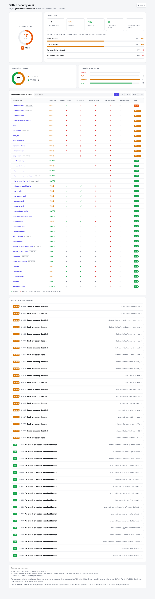

# 🛡️ AI Security Fence

A security audit skill for AI coding agents (Claude Code and friends). It scans the
attack surface that *grows* when you connect an LLM to your machine, code, and
services — then renders an interactive HTML dashboard of severity-ranked findings,
each with a one-click **"Fix with Claude"** button.

> **Honest scope:** no scanner finds *everything*. AI Security Fence is strong on the
> **AI/agent attack surface** — where few tools look (secrets baked into LLM context,
> excessive tool/agency permissions, MCP token sprawl) — and **orchestrates proven
> open-source scanners** (gitleaks, trufflehog, semgrep, grype) for the rest. Every
> report shows exactly **what ran and what was skipped**, so you're never given false
> confidence.



## What it scans

| Surface | What it catches | Engine |
|---|---|---|
| **Local AI config & memory** | Secrets in `CLAUDE.md` / memory / dotfiles (escalated to Critical — they load into every prompt), loose perms on `~/.aws` `~/.ssh` `~/.pgpass`, over-broad agent permissions, disabled sandbox | built-in |
| **Project secrets** | ~25 secret signatures (cloud keys, tokens, private keys, DB URLs) + entropy, in any codebase | built-in |
| **Secrets (deep)** | Verified-live secrets across the filesystem | `gitleaks`, `trufflehog` |
| **Code (SAST)** | Injection, crypto misuse, unsafe APIs | `semgrep --config auto` |
| **Dependencies (SCA)** | Known CVEs in your dependencies | `grype`, `pip-audit`, `npm audit` |
| **GitHub** | Public repos that should be private, secret-scanning/push-protection off, secrets in history | `gh` CLI |
| **MCP / connected tools** | Inline plaintext tokens, servers with excessive write/charge scope (OWASP LLM08) | config files |
| **BI / data tools** | Public dashboards/queries, credentials in query text | service API (metadata) |

## Why "AI" security?

Connecting an LLM agent to your system adds attack surface most scanners ignore:

- **Secrets in context** — a password in `CLAUDE.md` or a memory file is sent to the
  model on *every* prompt and may surface in responses, logs, or tool calls.
- **Excessive agency** — an MCP server or `Bash(*)` auto-approve lets a prompt-injection
  payload take real actions (OWASP LLM08).
- **Token sprawl** — OAuth/API tokens for connected tools sitting in plaintext config.

Fence audits these *alongside* the classic secret/code/dependency checks.

## Install

```bash
git clone https://github.com/<you>/ai-security-fence.git
cd ai-security-fence
./install.sh          # symlinks the skill into ~/.claude/skills/
```

Then in Claude Code:

```
/security-fence              # audit current repo + local AI surface
/security-fence check github # GitHub-only posture audit (analytics dashboard)
/security-fence scan ./app   # a specific project only
/security-fence fix SEC-003  # apply one finding's remediation (asks first)
```

Scope is honored: name a surface and only that surface is scanned. The GitHub
audit pulls real per-repo controls (secret scanning, push protection, branch
protection, Dependabot & secret-scanning alerts, visibility) and renders a
**posture score, control-coverage, and a sortable repository security matrix** —
analytics, not decoration.

### Optional engines (more coverage)

Fence works with zero dependencies (built-in scanner only). Install any of these to
deepen coverage — Fence auto-detects them and degrades gracefully if absent:

```bash
brew install gitleaks trufflehog grype     # macOS
pipx install semgrep pip-audit
```

## Standalone (no Claude)

The scanners are plain Python 3 (stdlib only) — usable in CI or a pre-commit hook:

```bash
python3 skill/security-fence/scripts/run_scan.py --target . \
        --out findings.json --html report.html
```

Exit is always 0 (report-only). For CI gating, parse `findings.json` and fail on
`critical`/`high`.

## How the Fix buttons work

Each finding's **🔧 Fix with Claude** button copies a concrete, self-contained
remediation instruction to your clipboard. Paste it into your AI coding agent and it
applies *that* fix — asking before any destructive change. Live credentials must be
**rotated by you**; Fence flags and guides, it never rotates silently.

## Privacy & safety

- **Read-only.** Scanning never writes, deletes, POSTs, or mutates a repo/remote.
- **Secrets are redacted.** Reports store a fingerprint (`abc…yz len=40 fp=1a2b3c`),
  never the value. *But the report lists secret **locations*** — treat it as sensitive.
- **Offline.** The HTML is fully self-contained (no CDN, no telemetry).

## Contributing

Issues and PRs welcome — especially new secret signatures, engine adapters, and
connected-service checks. See [CONTRIBUTING.md](CONTRIBUTING.md).

## License

[MIT](LICENSE)
